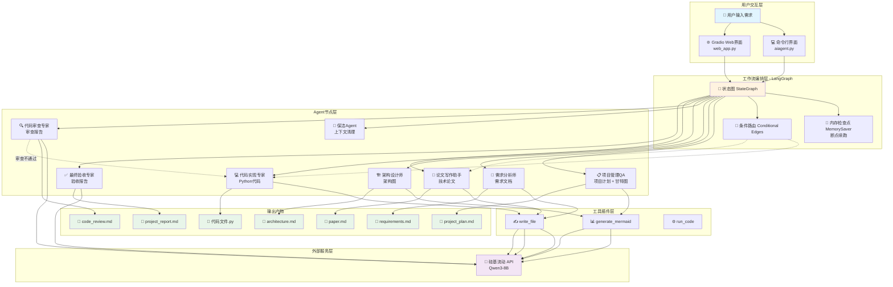

# 🧠 Multi-Agent Collaboration System

[](https://www.python.org/downloads/)
[](https://opensource.org/licenses/MIT)
[](https://github.com/langchain-ai/langgraph)

基于 **LangGraph** 和 **硅基流动 API** 的多 Agent 协作系统，能够自动完成软件开发全流程：项目规划 → 需求分析 → 架构设计 → 代码实现 → 代码审查 → 论文撰写 → 最终验收报告。

> 就像拥有一个由「项目经理、需求分析师、架构师、代码专家、审查专家、论文助手」组成的智囊团，全天候为你工作。

---

## ✨ 特性

- **5+ 专业 Agent 角色**  
  项目管理 QA、需求分析师、架构设计师、代码实现专家、代码审查专家、论文写作助手、保洁 Agent（上下文清理）、最终验收专家。

- **闭环代码质量保障**  
  代码审查不通过会自动触发修复，最多重试 3 次，确保产出可运行的高质量代码。

- **动态工具调用**  
  支持写文件、运行 Python 代码、生成 Mermaid 图表（甘特图、架构图）等，Agent 可以灵活使用工具完成任务。

- **断点续跑**  
  意外中断后输入 `continue` 即可恢复进度，无需重新执行已完成步骤。

- **两种交互方式**  
  - **命令行**：直接运行 `aiagent.py`，适合服务器或快速测试。  
  - **Gradio 网页界面**：运行 `web_app.py`，提供可视化进度、文件下载、实时日志。

- **全流程文档自动生成**  
  每个阶段都会输出结构化文档（Markdown、Python 代码、Mermaid 图），最终汇总成一份完整的验收报告。

---

## 📦 依赖环境

- Python 3.10 或更高版本
- 需要注册 [硅基流动](https://siliconflow.cn/) 账号并获取 API Key

### 主要 Python 包
```

langchain>=1.2.15
langgraph>=1.1.8
langchain-openai
gradio
torch
pydantic

```
完整的依赖列表见 [requirements.txt](requirements.txt)。
---

## 🔧 安装与配置

### 1. 克隆仓库

```bash
git clone https://github.com/AtlasCages/Multi-agent-system.git
cd Multi-agent-system
```
### 2. 安装依赖

```bash
pip install -r requirements.txt
```
### 3. 设置 API Key

本项目使用硅基流动的 API（支持 Qwen3-8B 等模型）。请先在 siliconflow.cn 注册并获取 API Key。

然后设置环境变量：

· Linux / macOS:
  ```bash
  export SILICONFLOW_API_KEY="你的API密钥"
  ```
· Windows (CMD):
  ```cmd
  set SILICONFLOW_API_KEY=你的API密钥
  ```
· Windows (PowerShell):
  ```powershell
  $env:SILICONFLOW_API_KEY="你的API密钥"
  ```
## 🧩 系统架构图

下面是本多 Agent 协作系统的整体架构，展示了从用户输入到最终产出的完整工作流：


## 🚀 使用方法

### 方式一：命令行交互

```bash
python aiagent.py
```

然后根据提示输入项目需求（例如 “开发一个命令行的待办事项管理工具”），系统会依次执行各个 Agent 步骤，并在当前目录生成 project_output_时间戳/ 文件夹，其中包含所有产出文件。

在命令行中可以输入：
  ```
· exit – 退出程序
· continue – 从上次中断处恢复任务
  ```
### 方式二：Gradio 网页界面

```bash
python web_app.py
```

浏览器自动打开 http://localhost:7860，在文本框中输入需求，点击 🚀 启动，即可看到实时执行日志和生成的文件列表，支持在线下载。


## 📂 输出文件示例

运行完成后，输出目录下会生成类似以下文件：

```
project_output_20260521_143022/
├── project_plan.md          # 项目计划（含甘特图）
├── requirements.md          # 结构化需求文档
├── architecture.md          # 系统架构图（Mermaid）
├── todo_manager.py          # 最终生成的 Python 代码
├── code_review.md           # 代码审查报告
├── paper.md                 # 技术论文
├── project_report.md        # 最终验收报告（汇总）
└── agent_state.json         # 断点续跑的状态文件
```
## 🎯 示例输入

你可以尝试以下需求：

开发一个命令行待办事项管理工具，支持添加、完成、删除、列出任务，数据保存在 JSON 文件中。

系统将自动完成：

1. 制定开发计划（含甘特图）
2. 输出详细需求文档
3. 设计系统架构（Mermaid 图）
4. 生成可运行的 Python 代码
5. 代码审查并提出修改意见（若不通过则自动修复）
6. 撰写技术论文
7. 汇总验收报告

## ⚙️ 自定义配置
```
· 更换模型：编辑 aiagent.py 中的 MODEL_NAME 变量，硅基流动支持 Qwen/Qwen3-8B、deepseek-ai/DeepSeek-V3 等模型。
· 调整重试次数：修改 MAX_RETRIES 和 should_fix_code 中的修复次数限制。
· 添加新工具：使用 @tool_plugin 装饰器，参考 run_code 函数的方式即可注册新工具。
```
## 🛠️ 常见问题
```
1. 提示 “未找到 SILICONFLOW_API_KEY 环境变量”
   请确认已正确设置环境变量，并重启终端/IDE。也可以在代码中临时写入（仅测试用，不要提交到公开仓库）。
2. 代码审查总是通不过或陷入无限循环
   请检查输出的 code_review.md，看审查意见是否明确指出了真实问题。如果审查逻辑过于严格，可以适当放宽系统 prompt 中的要求。
3. 工具调用格式错误
   本系统已内置了针对 Qwen3-8B 输出格式的容错解析（safe_parse_tool_call），大多数情况会自动修复。如果反复出现，可以尝试更换模型或降低 temperature。
4. Gradio 界面无法显示文件列表
   请确认 web_app.py 中正确设置了 aiagent.PROJECT_OUTPUT_DIR，并授予了读取权限。
```
## 🤝 贡献

欢迎提交 Issue 和 Pull Request。如果你有好的建议或发现了 Bug，请随时告知。

---

## 📄 许可证

本项目采用 MIT License 开源协议。
